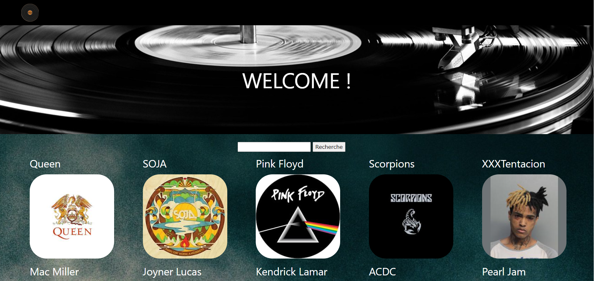

# Groupie-Tracker

## En quoi cela consiste :
Ce projet consiste à recevoir une API, la manipuler (données) afin de créer un site en affichant les informations de celle-ci.

## Execution :
Pour lancer le code il vous suffit juste de taper la commande suivante "go run ;/main.go" dans ce même fichier de plus il faut taper "localhost:8080" dans votre navigateur.

## Technologies utilisées :
* Go
* Javascript

## Sources :
* https://developers.google.com/maps/documentation/javascript/examples
* https://www.w3schools.com/
* https://www.axantis.fr/